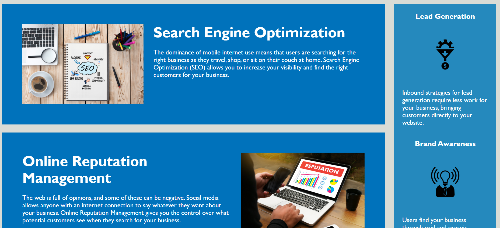

# Code Refactor Starter Code

# <Bootcamp Challenge 1 >

## Description

Provide a short description explaining the what, why, and how of your project. Use the following questions as a guide:

- The motivation behind this challenge was to improve the quality of the Horiseon website by refactoring the code. I built this project in order to improve my own understanding of refactorization and deployment and also to see how code changes directly impact the front-end UI of a website. This challenge solves two problems: 1. improving the legibility of the code for other developers and improving the UI functionality for website viewers. By doing this, I learned about how individual naming elements and attributes impact various portions of a website's UI and how small tweaks can drastically impact the transferability of code.

https://nabeekha.github.io/Horiseon-Refactor/

## Table of Contents (Optional)

If your README is long, add a table of contents to make it easy for users to find what they need.

- [Installation](#installation)
- [Usage](#usage)
- [Credits](#credits)
- [License](#license)

## Installation

What are the steps required to install your project? Provide a step-by-step description of how to get the development environment running.

To install this project, go to github. Clone the bootcamp-challenge-1 repository. From here you will be able to access the index.html file and open it with live server to view the website

## Usage

Provide instructions and examples for use. Include screenshots as needed.

To add a screenshot, create an `assets/images` folder in your repository and upload your screenshot to it. Then, using the relative file path, add it to your README using the following syntax:

## Credits

The primary tutorial followed was the Georgia Tech Full Stack Development Bootcamp
https://courses.bootcampspot.com/courses/3101/modules 

## License

The last section of a high-quality README file is the license. This lets other developers know what they can and cannot do with your project. If you need help choosing a license, refer to [https://choosealicense.com/](https://choosealicense.com/).

This GitHub repository was created with the MIT license s

---

🏆 The previous sections are the bare minimum, and your project will ultimately determine the content of this document. You might also want to consider adding the following sections.

## Tests and screenshots

To test this application, please clone the git repository. You can test the image alt attribute by removing or altering the main image attribute. Refresh the Live server to view the alt image line. 

The following pages show screenshots of the deployed application

